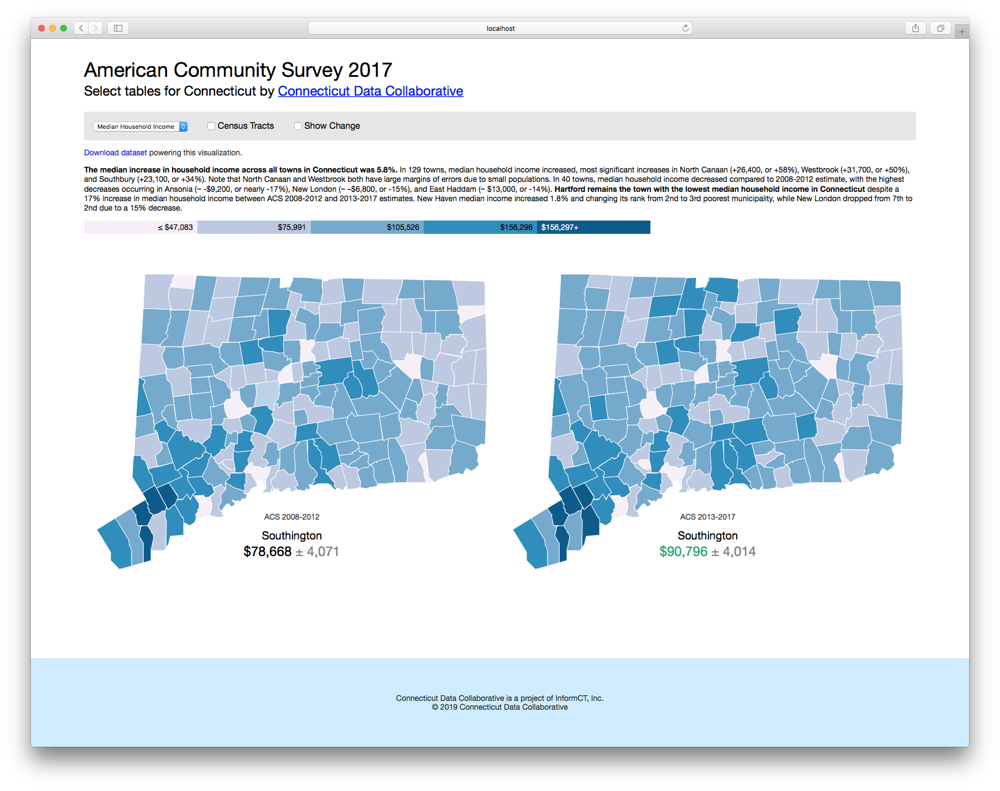

# Before-After Map Template

This is a [Svelte](https://svelte.technology) project to display two interactive data maps side by side, colored based on Jenks breaks.



## Get started

To start, make sure you have [Node.js](https://nodejs.org) installed. Clone this repository and install the dependencies:

```bash
git clone https://github.com/CT-Data-Collaborative/before-after-map.git
cd before-after-map 
npm install
```

Then start [Rollup](https://rollupjs.org):

```
npm run dev
```

Navigate to [localhost:5000](http://localhost:5000). You should see the app running. Edit a component file in `src`, save it, and reload the page to see your changes.


## Customize with your own data

### 1. Start by editing `src/config.js` with your own configuration

```js
export default {
  "title": "American Community Survey 2017",
  "subtitle": "Select tables for Connecticut by <a href='http://ctdata.org'>Connecticut Data Collaborative</a>",
  "footer": "Connecticut Data Collaborative is a project of InformCT, Inc.<br>&copy; 2019 Connecticut Data Collaborative",
  "defaultGeographyPath": "./geo/towns.geojson",
  "extraGeographyPath": "./geo/tracts.geojson",
  "extraGeographyName": "Census Tracts",
  "geojsonGeographyProperty": "name",
  "data": []
}
```

* `title`, `subtitle`, and `footer` are HTML strings.
* `defaultGeographyPath` is a path to a GeoJSON file with your geography, which is displayed on page load by default.
* `extraGeographyPath` is an additional GeoJSON file which can be triggered by a checkbox with the label from `extraGeographyName`. This could be a more detailed (eg Census tracts) map, or a less detailed map (counties). Note that the same *csv* spreadsheet powers both the default and the extra geography.
* `geojsonGeographyProperty` defines the name of the parameter which stores the geography name in each of the features of the GeoJSON file (that is, layer.feature.properties.`geojsonGeographyProperty`). This needs to be the same for both GeoJSON files.

### 2. Define your data in `src/config.js`

The `data` key of the config file is an array of JSON objects that define the datasets to be put onto the map.

```js
{
    // Nice name to be displayed
    "name": "Median Household Income",
    // Dataset file path (csv), can be absolute URL or relative path from /public folder
    "file": "./data/median_household_income.csv",
    // Prefix for the values (eg "$")
    "prefix": "$",
    // Suffix for the values (eg "%", " people")
    "suffix": "",
    // Time period of the left map (to use in annotation below the map)
    "before": "ACS 2008-2012",
    // Whether to display margins of error for "before" map
    "beforemoe": true,
    // The time period of the map on the right ("after")
    "after": "ACS 2013-2017",
    // Whether to display margins of error on the "after" map
    "aftermoe": true,
    // Whether increase from before to after value is positive (in green) or negative (in red)
    // For example, increase in Income is positive, increase in Poverty Rate is negative
    "positiveIncrease": true,
    // HTML string to be displayed in a paragraph above the legend
    "description": "<b>The median increase in household income across all towns in Connecticut was 5.8%.</b> In 129 towns, median household income increased, most significant increases in North Canaan (+26,400, or +58%), Westbrook (+31,700, or +50%), and Southbury (+23,100, or +34%). Note that North Canaan and Westbrook both have large margins of errors due to small populations. In 40 towns, median household income decreased compared to 2008-2012 estimate, with the highest decreases occurring in Ansonia (~ -$9,200, or nearly -17%), New London (~ –$6,800, or -15%), and East Haddam (~ $13,000, or -14%). <b>Hartford remains the town with the lowest median household income in Connecticut</b> despite a 17% increase in median household income between ACS 2008-2012 and 2013-2017 estimates. New Haven median income increased 1.8% and changing its rank from 2nd to 3rd poorest municipality, while New London dropped from 7th to 2nd due to a 15% decrease."
},
```

### 3. Create .csv data files

Data files can be stored in `/public` folder (eg in `/public/data/*`) or remotely.

Each parameter is a separate .csv dataset with data for all geo features. Each *csv* file needs to have 5 columns: `geography` needs to match the relevant property of the layers in the geojson file, `before` are the values for the left map, `beforemoe` are margins of error for the values for the left map, `after` are the values for the map on the right, `aftermoe` are the margins of errors for values defined in `after`. For example,

```csv
geography,before,beforemoe,after,aftermoe
Bethel,88024,5083,97289,8779
Bridgeport,39822,1597,44841,1451
Brookfield,111096,6658,113009,9162
Danbury,66281,2160,68068,4517
```

### 4. Publish your map
In Terminal, run

```
npm run build
```

This will compile all relevant Svelte files, JavaScript, and CSS and put it in `public/` folder. Open `index.html` to see the app. It works entirely in front-end, so you can serve it from GitHub Pages or Amazon S3 bucket - no backend required.